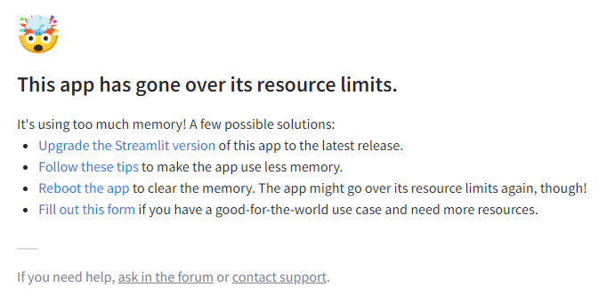

# Read me!

## Important things to know about streamlit.

1. Streamlit clones the whole repository. Therefore it makes sense to put the webdemonstrator in a separate repository. This makes the application install faster.
2. Streamlit applications need to be set public on [share.streamlit.io](https://share.streamlit.io/). Otherwise they can only accessed by the owner.
3. Streamlit applications get suspended when they use more than 1 GB of RAM.
   </br></img>
4. Streamlit applications are put to sleep if noone uses them for 7 days.
5. Streamlit applications can also crash due to other reasons. Usually a reboot resolves the problem.

## How to deal with large files such as model weights?

1. Files smaller than 100 MB can be commited on GitHub without LFS. Using LFS nonetheless increases the risk of reaching the LFS bandwidth limit (downloading 1 GB per month), especially when the application has to be rebooted multiple times.
2. Splitting large files into chunks smaller than 100 MB avoids the use of LFS on Github.
   ```
   ...
   chunk_size = 1024*1024*32 # 32 MB
   os.makedirs(chunk_file_directory)
   large_file = open(large_file_path, "rb")
   i = 0
   bytes = large_file.read(chunk_size)
   while bytes:
       chunk_file_name = os.path.join(chunk_file_directory, f"chunk{i}.txt")
       chunk_file = open(chunk_file_name, "wb")
       chunk_file.write(bytes)
       chunk_file.close()
       bytes = large_file.read(chunk_size)
       i += 1
   large_file.close()
   ```
3. Google Drive could be used to download large files from, but many python libraries have problems with today's authentication.
